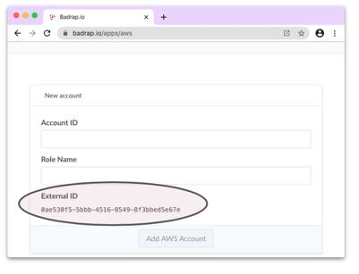
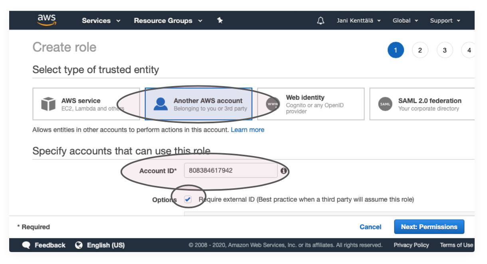
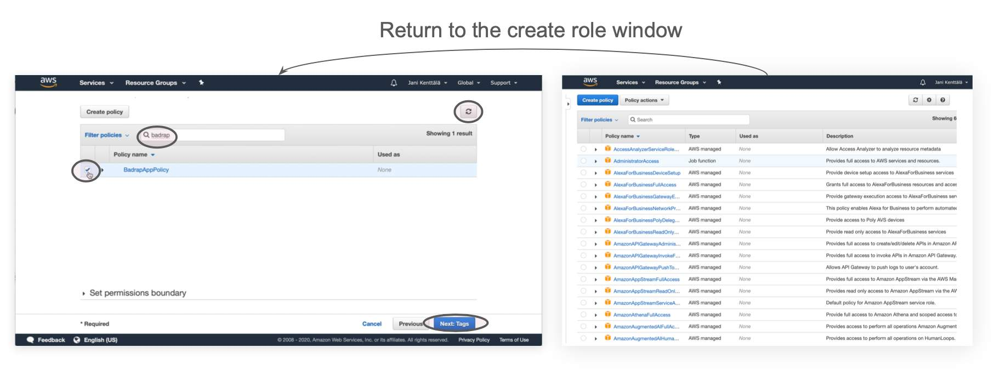
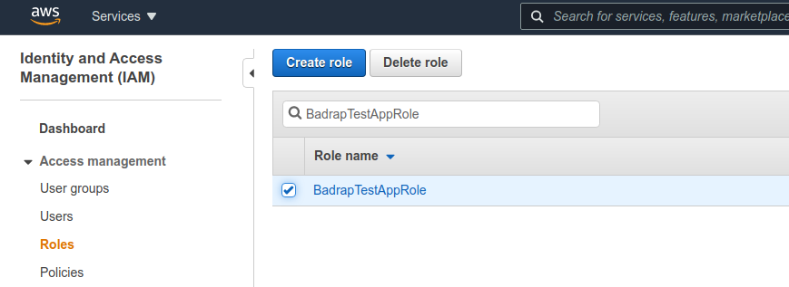
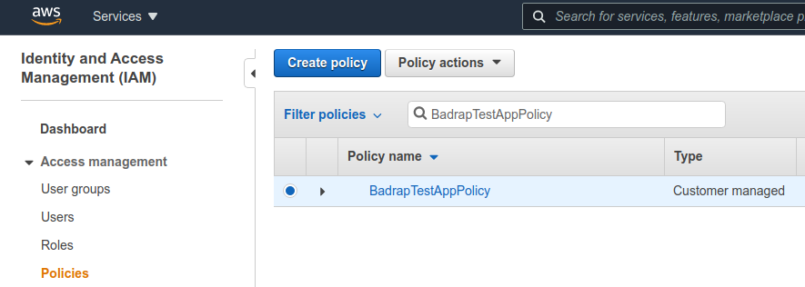

# Amazon Web Services (AWS)

This app allows you to synchronize your AWS assets into Badrap and receive security notifications about them. The app needs to be installed and enabled under your Badrap user account to get started. The app fetches a list of your organization's public IP addresses from your AWS installation with your consent, and adds those assets under your Badrap user account. Below, we describe the actions needed in Badrap. We also explain what you need to do in AWS to grant the minimum permissions for Badrap to fetch the public IP addresses.


## Install the AWS app in Badrap

1. Open the [AWS app page](https://badrap.io/apps/aws).
1. Install the app.
1. Take note of the External ID value that the app has generated for you. You'll need this later.



## Create Required AWS Role & Policy

Setting up the Badrap app with Amazon Web Services requires configuring role delegation using AWS IAM.

1. Create a new role in the [AWS IAM console.](https://console.aws.amazon.com/iam/home#/roles)
2. Select `Another AWS account` for the role type.
3. Enter `808384617942` (Badrap's Account ID) as the `Account ID`.


4. Check the `Require external ID` option, and enter the External ID that the app generated for you earlier as the `External ID`.
5. Leave the `Require MFA` option unchecked.
6. Click `Next: Permissions`.


7. If you've already created a policy, skip the following substeps. Otherwise click `Create Policy`, which opens a new window.


   1. Select the `JSON` tab and enter the following policy snippet into the text box:

   ```json
   {
     "Version": "2012-10-17",
     "Statement": [
       {
         "Sid": "VisualEditor0",
         "Effect": "Allow",
         "Action": [
           "ec2:DescribeInstances",
           "lightsail:GetInstances",
           "route53:GetHostedZone",
           "route53:ListHostedZones",
           "route53:ListResourceRecordSets",
           "route53domains:ListDomains"
         ],
         "Resource": "*"
       }
     ]
   }
   ```
   
   2. Click `Review policy`.
   3. Name the policy (e.g., `BadrapAppPolicy`).
   4. Click `Create policy`
   5. Return to the `Create role` window.
   6. Refresh the list of policies
8. Select the BadrapAppPolicy


9. Click `Next: Tags`.
10. Click `Next: Review`.
11. Name the role (e.g., `BadrapAppRole`).
12. Click `Create role`.

## Finish the Installation

1. Return to the [AWS app page](https://badrap.io/apps/aws).
1. Enter your [AWS Account ID](https://console.aws.amazon.com/billing/home?#/account) into the `Account ID` field.
1. Enter the name of the AWS role you created earlier. **Note that the role name is case sensitive!**
1. Click `Add`.

## Uninstalling the app

If you want to stop using the Badrap AWS app, you can uninstall it from your Badrap [AWS app page](https://badrap.io/apps/aws). 

Then you can clean up the app role and policy definitions from your [AWS IAM console](https://console.aws.amazon.com/iam/home#/roles). 

1. Under the [Roles](https://console.aws.amazon.com/iam/home#/roles) section, search for the role you created earlier (e.g. "BadrapTestAppRole") and select **Delete**. 

<div style="text-align: center;">
   
</div>

2. Under the [Policies](https://console.aws.amazon.com/iam/home#/policies) section, search for the policy you created and connected to the role (e.g. "BadrapTestAppPolicy"), and from the **Policy actions** drop-down menu select **Delete**. 

<div style="text-align: center;">
   
</div>

That's it, you have successfully uninstalled the Badrap AWS app and cleaned up its configuration from your AWS installation.
