# Microsoft Azure

This app allows you to synchronize your Microsoft Azure assets into Badrap and to receive security notifications about them. The app fetches a list of your organization's public network assets from your Azure installation with your consent, and adds those assets under your Badrap user account. The asset types listed are: 

 * Public IP addresses from your Azure installation
 * DNS records (A, AAAA, CNAME, MX, NS) from all public DNS zones managed by Azure
 * Azure DNS alias records

## Install the Azure app in Badrap

Anyone can install the Azure app in Badrap, but you will need Global Administrator, Application Administrator or Cloud Application Administrator level privileges to enable the app to access your Azure installation and to list your assets from there. If you do not have administrator role privileges, refer your administrator to these instructions and ask them to help you with the app configuration. 

1. Open the [Azure app page](https://badrap.io/apps/azure). 
   <div style="text-align: center;">
      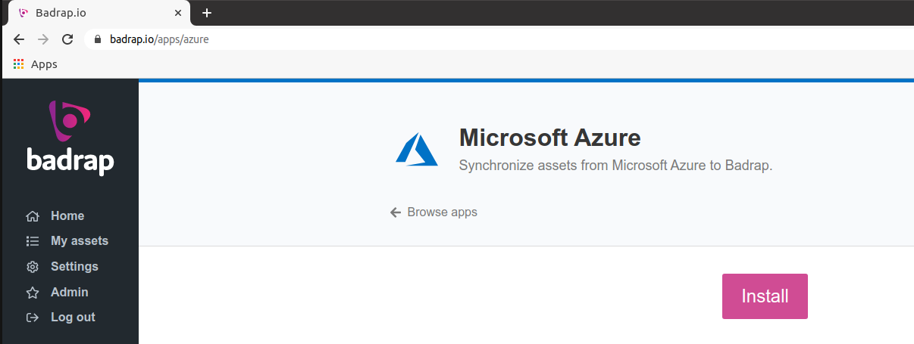
   </div>

2. The app asks for your consent to create & manage new assets. Click **Install the app**. 
   <div style="text-align: center;">
      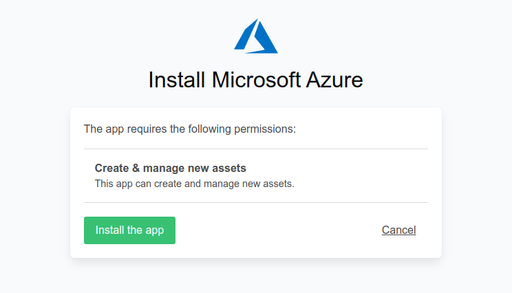
   </div>

   The Azure app is now installed. Next, you have to create a service principal for the app in your Azure installation, and to provide its configuration details to the app settings. You can do this either by using the Azure CLI (incredibly easy) or your Azure Portal (still easy). 

## Using the Azure CLI

Note that installing Azure CLI to your computer is outside of the scope of this guide. You can use [Microsoft's Azure CLI installation instructions](https://docs.microsoft.com/en-us/cli/azure/install-azure-cli) to get started if you haven't installed it previously.

1. Log into Azure using your Azure CLI utility. 
   ```
   az login
   ```

2. List your subscription details:
   ```
   az account show
   ```
   The listing will look like this:
   ```
   {
     "environmentName": "AzureCloud",
     "homeTenantId": "aaaaaaaa-bbbb-cccc-dddd-eeeeeeeeeeee",
     "id": "11111111-2222-3333-4444-555555666666",
     "isDefault": true,
     "managedByTenants": [],
     "name": "Pay-As-You-Go",
     "state": "Enabled",
     "tenantId": "aaaaaaaa-bbbb-cccc-dddd-eeeeeeeeeeee",
     "user": {
       "name": "adminroleuser@example.com",
       "type": "user"
     }
   }
   ```
   Make a note of the **id** field value (subscription ID) for the next step. If you want to add multiple subscriptions, make a note of all of their IDs. 

3. Use the `az ad sp` command to create an application as a service principal with Reader role privileges. Substitute `{subscription_id}` in the example below with the **id** value you noted down previously. Note that the `--name` parameter is optional and you can define any name you want for the service principal.
   ```
   az ad sp create-for-rbac --role "Reader" --scopes /subscriptions/{subscription_id} --name http://BadrapAzureApp
   ```
   The output will look like this:
   ```
   Creating 'Reader' role assignment under scope '/subscriptions/11111111-2222-3333-4444-555555666666'
     Retrying role assignment creation: 1/36
   The output includes credentials that you must protect. Be sure that you do not include these credentials in your code or
   check the credentials into your source control. For more information, see https://aka.ms/azadsp-cli
   {
     "appId": "aabbccdd-1122-3344-5566-eeeeffff7777",
     "displayName": "BadrapAzureApp",
     "name": "http://BadrapAzureApp",
     "password": "****************************",
     "tenant": "aaaaaaaa-bbbb-cccc-dddd-eeeeeeeeeeee"
   }
   ```
   If you want to add access to multiple subscriptions, simply include all of their IDs after the `--scopes` parameter, separated with spaces: 
   ```
   az ad sp create-for-rbac --role "Reader" --scopes /subscriptions/{subscription_id1} /subscriptions/{subscription_id2} --name http://BadrapAzureApp
   ```
   If you want to restrict the permissions of the service principal even further, instead of the default Reader role you can create a custom role and assign it to the service principal. The custom role needs to have permissions to only a few resources. First, create the service principal without assigning any role to it.  
   ```
   az ad sp create-for-rbac --skip-assignment --scopes /subscriptions/{subscription_id} --name http://BadrapAzureApp
   ```
   Then, create your custom role with only minimal privileges:
   ```
   az role definition create --role-definition '{
       "Name": "CustomReaderBadrapApp",
       "Description": "Custom restricted Reader role for Badrap Azure app",
       "AssignableScopes": [
               "/subscriptions/445566eeff-2222-aaaa-ffff-112233aabbcc"
       ],
       "Actions": [
           "Microsoft.Network/publicIPAddresses/read",
           "Microsoft.Network/dnszones/read",
           "Microsoft.Network/dnszones/all/read"
       ],
       "NotActions": [],
       "DataActions": [],
       "NotDataActions": []
   }'
   ```
   Lastly, assign the custom role to the service principal you created earlier:
   ```
   az role assignment create --role "CustomReaderBadrapApp" --assignee http://BadrapAzureApp --scope /subscriptions/{subscription_id}
   ```

4. Under your Badrap Azure app settings, add your account details. 
   <div style="text-align: center;">
      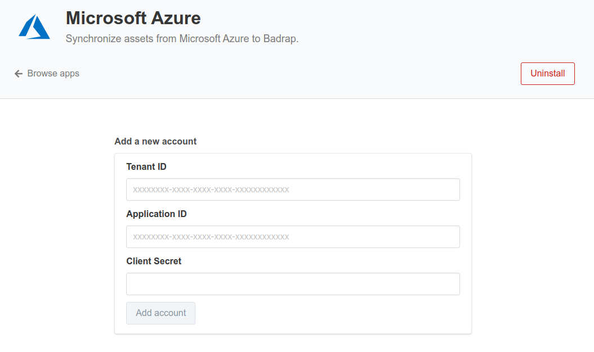
   </div>

5. Copy the **tenant**, **appId** and **password** values into the app settings: 
   * Tenant ID: `tenant`
   * Application ID: `appId`
   * Client Secret: `password`

6. In a few minutes after the Badrap Azure app has been configured into use, you should see a listing of your Azure assets under [My Assets](https://badrap.io/assets).
   <div style="text-align: center;">
      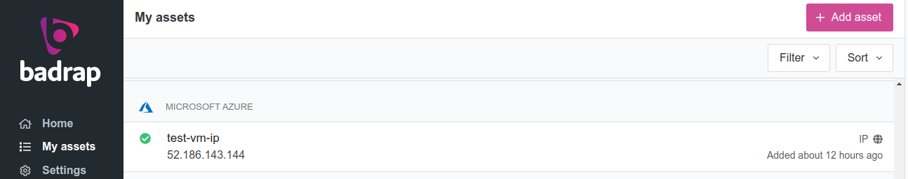
   </div>

## Using Azure Portal

1. Log into your [Azure Portal](https://portal.azure.com). Select Azure Active Directory from the sidebar. 
   <div style="text-align: center;">
      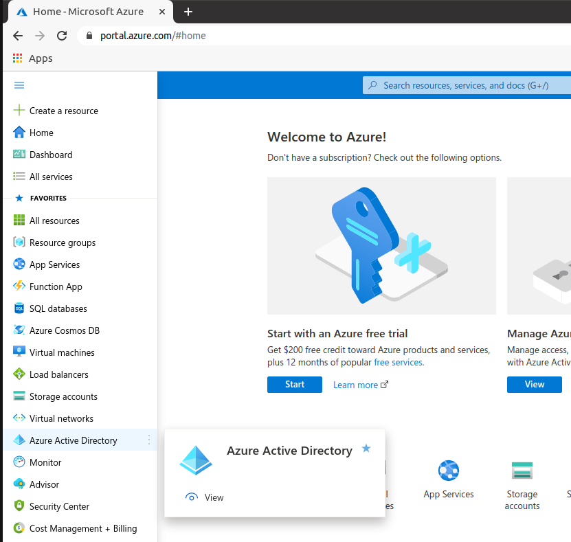
   </div>

2. Go to **App Registrations**.
   <div style="text-align: center;">
      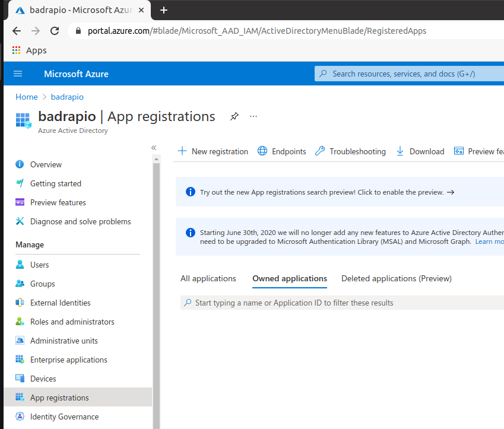
   </div>

3. Click **New registration**. Enter the following details:
   * Name: Badrap Azure App
   * Supported Account Types: Accounts in this organizational directory only (your organization only)
   * Redirect URI (optional): leave blank
   <div style="text-align: center;">
      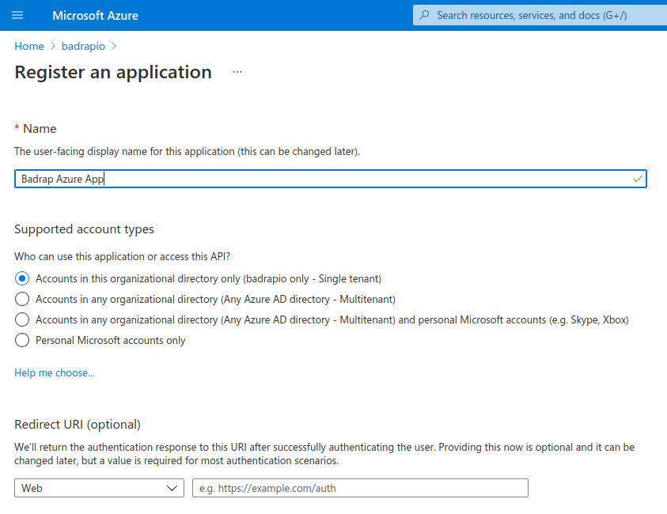
   </div>

4. Click **Register** to complete the new app registration.

5. Now, give Reader permissions to the application. Go to **Subscriptions** via the Azure Portal top search bar or via the left sidebar. 
   <div style="text-align: center;">
      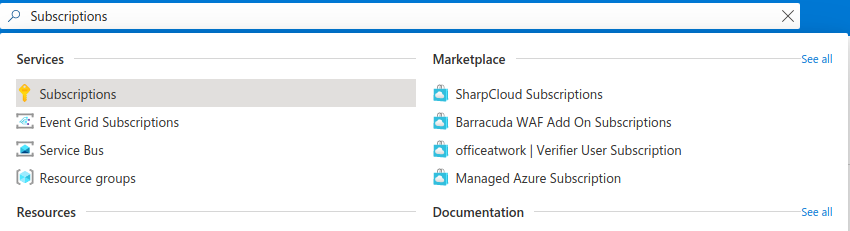
   </div>

6. Choose the subscription you want to use. If you have multiple subscriptions that you want to add, you can just repeat steps 6-10 to add access to all of them. 
   <div style="text-align: center;">
      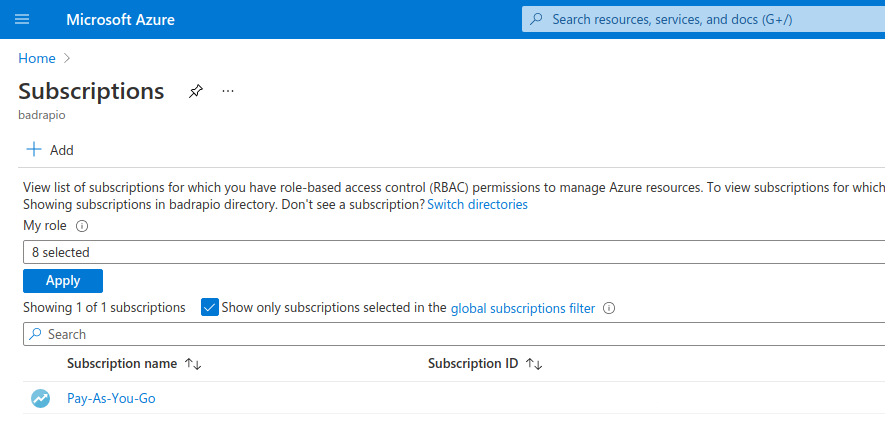
   </div>

7. Select **Access Control (IAM)** in the subscription page.
   <div style="text-align: center;">
      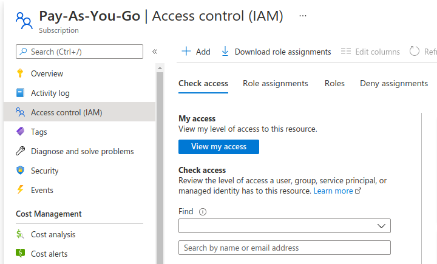
   </div>

8. Click **Add** and select **Add role assignment**.
   <div style="text-align: center;">
      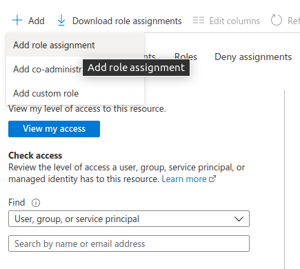
   </div>

9. For "Role", select **Reader**. For "Assign access to", select **User, group or service principal**.

10. In the Select menu, type the name of the application you created in the previous step (e.g. "Badrap Azure App") and click on the search result. The app should now appear in the "Selected members" list. Then click **Save**.
    <div style="text-align: center;">
       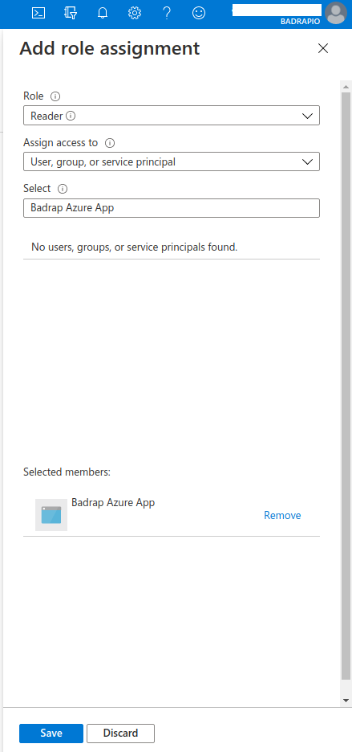
    </div>

11. If you want to restrict the permissions of the service principal even further from the default Reader role, you can create a custom role and assign it to the service principal. The custom role needs to have permissions to only a few resources. First, under the **Access Control (IAM)** page under your subscription (see step 7 above), create your custom role with only minimal privileges by clicking **Add** and selecting **Add custom role**. 
    <div style="text-align: center;">
       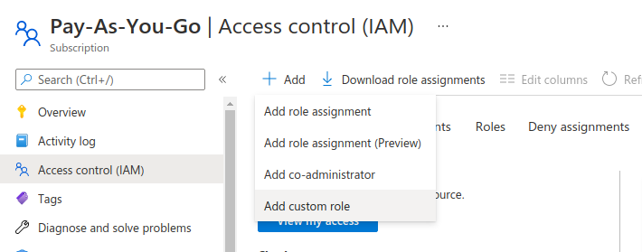
    </div>

    Under the "Basics" tab in the "Create new role" dialog, create a name for your role under **Custom role name**, e.g. "CustomReaderBadrapApp". For **Description**, write down the purpose of the custom role, e.g. "Custom restricted Reader role for Badrap Azure app service principal". For **Baseline permissions**, select **Start from scratch**.
    <div style="text-align: center;">
       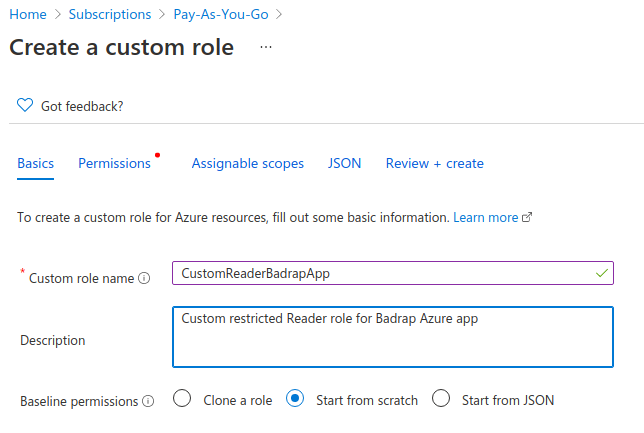
    </div>

    Under the "JSON" tab in the "Create new role" dialog, edit the JSON to look like this: 
    ```
    {
        "properties": {
            "roleName": "CustomReaderBadrapApp",
	         "description": "Custom restricted Reader role for Badrap Azure app",
            "assignableScopes": [
                 "/subscriptions/445566eeff-2222-aaaa-ffff-112233aabbcc"
            ],
            "permissions": [
                {
                    "actions": [
                        "Microsoft.Network/publicIPAddresses/read",
                        "Microsoft.Network/dnszones/read",
                        "Microsoft.Network/dnszones/all/read"
                    ],
                    "notActions": [],
                    "dataActions": [],
                    "notDataActions": []
                }
            ]
        }
    }
    ```
    <div style="text-align: center;">
       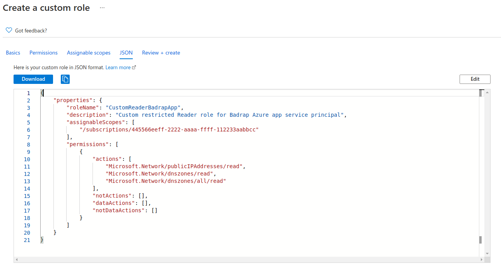
    </div>

    Review the custom role one more time in the **Review+create** tab, and then select **Create**. 

    Then, assign the custom role to the app service principal by following steps 8-10 above, but substituting your custom role name (e.g. "CustomReaderBadrapApp") in place of the Reader role in step 9. 

12. After you have assigned the necessary role for the service principal, you need to create a client secret for the app. Under **App Registrations**, select the application you created.
    <div style="text-align: center;">
       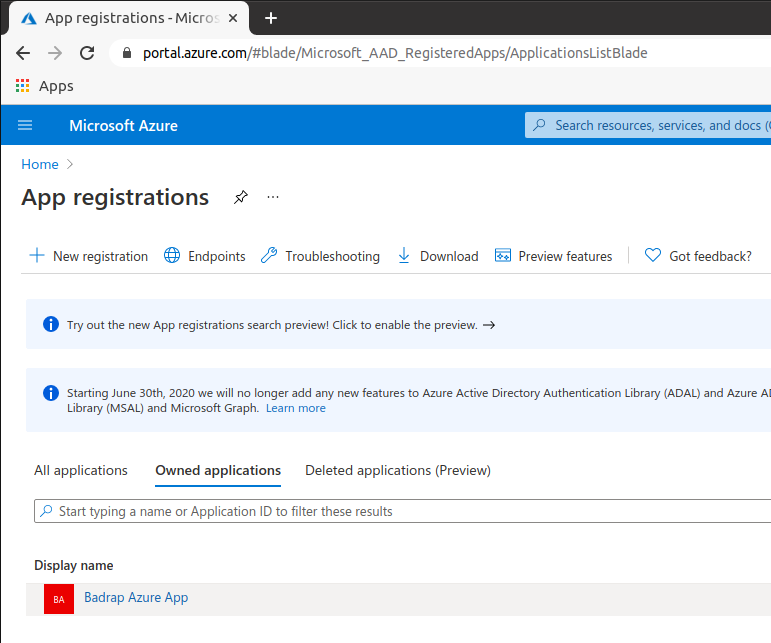
    </div>

13. Note down the **Directory (tenant) ID** and **Application (client) ID** values. 
    <div style="text-align: center;">
       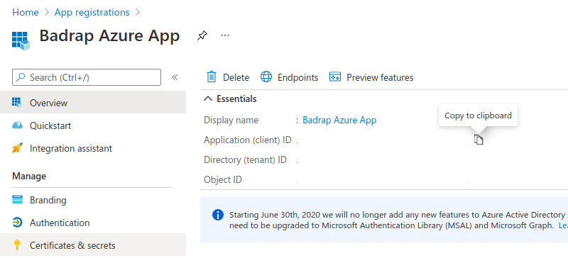
    </div>

14. Under the same app, select **Certificates and Secrets** in the Manage menu. 

15. Under "Client secrets", click on **New Client Secret**.

16. For the description field, you can use e.g. `badrapClientSecret`. Select a suitable time for expiration (e.g. one year), and click **Add**.

17. Note down the **Value** field from the generated client secret. 
    <div style="text-align: center;">
       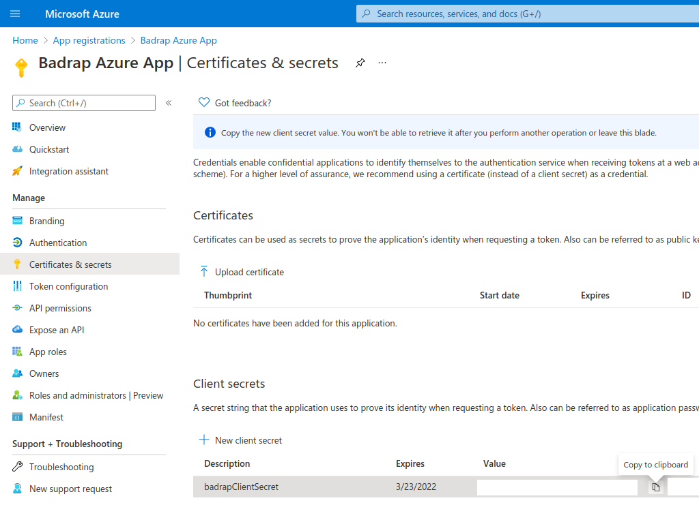
    </div>

18. Under your Badrap Azure app settings, add a new account. Copy the **Directory (tenant) ID**, **Application (client) ID** and **client secret** values you noted down earlier into the Badrap Azure app settings.
    <div style="text-align: center;">
       
    </div>

19. Click **Add account** to save your settings. 

20. In a few minutes after the app has been configured into use, you should see a listing of your Azure assets under [My Assets](https://badrap.io/assets).
    <div style="text-align: center;">
       
    </div>

## Uninstalling the app

If you want to stop using the Badrap Azure app, you should uninstall it from your Badrap [Azure app page](https://badrap.io/apps/azure). Then you can clean up the app configuration from your Azure AD installation using either Azure CLI or your Azure Portal dashboard. 

### Cleaning up via Azure CLI

1. If you want to clean up your Azure configuration using the Azure CLI, just delete the service principal with the `az ad sp delete` command:
   ```
   az ad sp delete --id http://BadrapAzureApp
   ```
   The output of the command should look like this:
   ```
   Removing role assignments
   ```
2. If you assigned a custom role for the service principal during the app registration, you can delete the custom role with this CLI command:
   ```
   az role definition delete --name "CustomReaderBadrapApp"
   ```
   You've now successfully cleaned up your Azure configuration.

### Cleaning up via Azure Portal

1. If you want to clean up your Azure configuration using your [Azure Portal](https://portal.azure.com), first log into the portal and select Azure Active Directory from the sidebar. 
   <div style="text-align: center;">
      
   </div>

2. Navigate to **App Registrations**.
   <div style="text-align: center;">
      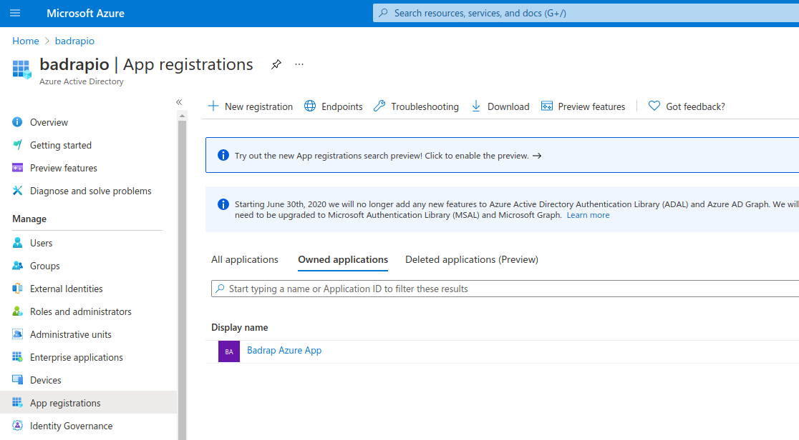
   </div>

3. Click on the app that you created earlier, e.g. "Badrap Azure App". 

4. Select **Delete** from the actions at the top. 
   <div style="text-align: center;">
      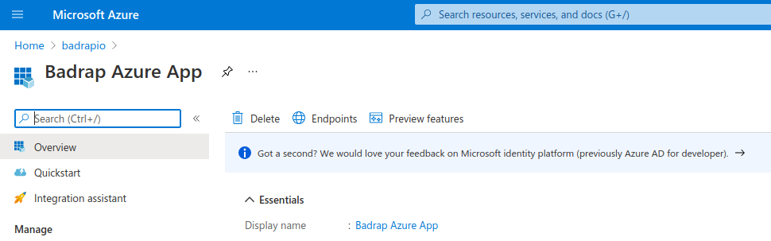
   </div>

5. This action will disable the app registration and move the app under the **Deleted applications** list on the App Registrations page. 

6. To delete the app registration and all its dependencies permanently, go to "Deleted applications", select the application (e.g. "Badrap Azure App"), and then choose **Delete permanently**.
   <div style="text-align: center;">
      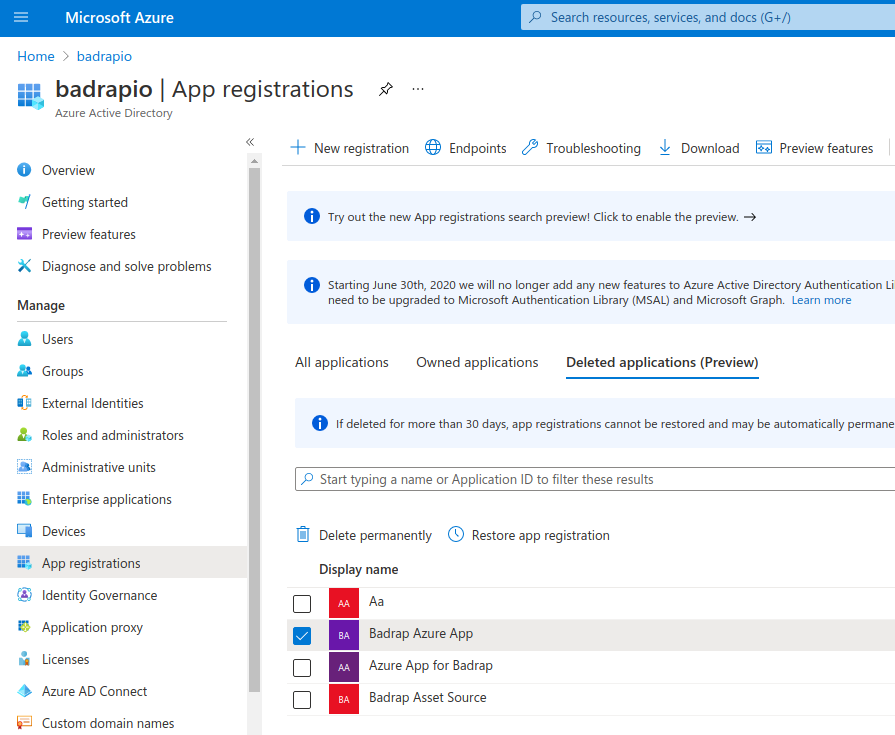
   </div>

7. If you created a custom role for your service principal instead of using the default Reader role, go to "Subscriptions" view, select your subscription, go to the "Access control (IAM)" menu, select "Roles", search for your custom role (e.g. "CustomReaderBadrapApp"), select the custom role, and click "Remove".
   <div style="text-align: center;">
      
   </div>

8. You've now successfully cleaned up your Azure configuration.
