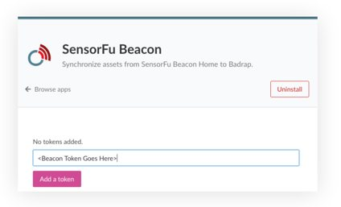

# SensorFu Beacon

Synchronize assets from SensorFu Beacon Home to Badrap.

## Install App

1. Open [Beacon app page](https://badrap.io/apps/beacon)
2. Click install
3. Review the permission the app requests. Click Install the app
4. Add home name and token you've received from SensorFu

5. You're done
