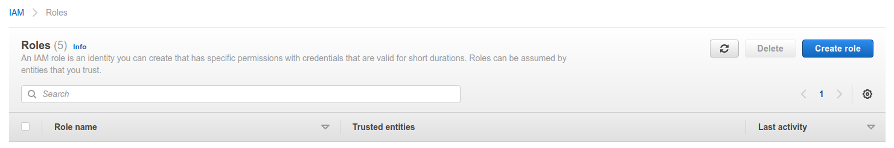

# Fraktal AWS Audit

This app allows you to audit and monitor your Amazon Web Services (AWS) assets for configuration weaknesses and security vulnerabilities automatically and continuously. It has been created in collaboration with our partner Fraktal Ltd, the experts in AWS security.

The app fetches a list of your public IP and domain assets from your AWS installation with your consent. It then launches Amazon Security Hub and Amazon GuardDuty scans for your assets, and
provides alerts about any critical identified weaknesses and vulnerabilities in your configurations. 

The instructions below explain the installation of the app, integration with your AWS environment, as well as what you need to do in AWS to enable Amazon Security Hub and
Amazon GuardDuty functionalities, and how to grant the minimum permissions for Badrap to list your AWS assets and to scan them using Amazon's own security tools. 

When the app identifies vulnerabilities, it will provide you with comprehensive details of the finding and a link to the AWS console to find out more. If you would like to receive expert assistance to mitigate or fix the findings, you can contact Fraktal Ltd for professional services.

## Install the Fraktal AWS Audit app

1. Open the Fraktal AWS Audit [app page](https://badrap.io/apps/fraktal).
2. Install the app.
<div style="text-align: center;">
   
</div>
3. The app asks for your permission to fetch your AWS assets and to add them to Badrap for monitoring.
<div style="text-align: center;">
   
</div>

## Create AWS role & policy

Configure role delegation for the app with the AWS IAM console.

1. Create a new role in the [AWS IAM console.](https://console.aws.amazon.com/iam/home#/roles)
<div style="text-align: center;">
   
</div>
2. Select `Another AWS account` for the role type.
3. Enter `927561705797` (AWS Audit app Account ID) as the `Account ID`.
4. Check the `Require external ID` option, and enter the External ID that the app generated for you earlier as the `External ID`.
5. Leave the `Require MFA` option unchecked.
<div style="text-align: center;">
   
</div>
6. Click `Next: Permissions`.
7. If you've already created a policy, skip the following substeps. Otherwise click `Create Policy`, which opens a new window.
   1. Select the `JSON` tab and enter the following policy snippet into the text box:

   ```json
   {
     "Version": "2012-10-17",
     "Statement": [
       {
         "Sid": "VisualEditor0",
         "Effect": "Allow",
         "Action": [
           "ec2:DescribeInstances",
           "lightsail:GetInstances",
           "route53:GetHostedZone",
           "route53:ListHostedZones",
           "route53:ListResourceRecordSets",
           "route53domains:ListDomains"
         ],
         "Resource": "*"
       }
     ]
   }
   ```   
   2. Click `Review policy`.
   3. Name the policy (e.g., `AWSAuditPolicy`).
   4. Click `Create policy`
   5. Return to the `Create role` window.
   6. Refresh the list of policies
8. Select `AWSAuditPolicy`.
9. Click `Next: Tags`.
10. Click `Next: Review`.
11. Name the role (e.g., `AWSAuditRole`).
12. Click `Create role`.

## Enable Amazon Security Hub and GuardDuty

The app uses Amazon's own scanning tools Security Hub and GuardDuty to monitor for weaknesses and vulnerabilities in your configurations. You need to enable these features in your Amazon console for the app to function properly.

1. Enable Security Hub
1. Enable GuardDuty

## Finish the installation

1. Return to the [Fraktal AWS Audit app page](https://badrap.io/apps/fraktal).
1. Enter your [AWS Account ID](https://console.aws.amazon.com/billing/home?#/account) into the `Account ID` field.
1. Enter the name of the AWS role you created earlier. **Note that the role name is case sensitive!**
1. Click `Add`.

## Uninstalling the app

If you want to stop using the app, you can uninstall the app and clean up the role delegation from your AWS IAM console. 

1. Go to the [Fraktal AWS Audit app page](https://badrap.io/apps/fraktal) and click **Uninstall**. 
<div style="text-align: center;">
   
</div>
2. Clean up the app role and policy definitions from your [AWS IAM console](https://console.aws.amazon.com/iam/home#/roles). 
3. Under the [Roles](https://console.aws.amazon.com/iam/home#/roles) section, search for the role you created earlier (e.g. "AWSAuditRole") and select **Delete**. 
<div style="text-align: center;">
   
</div>
4. Under the [Policies](https://console.aws.amazon.com/iam/home#/policies) section, search for the policy you created and connected to the role (e.g. "AWSAuditPolicy"), and from the **Policy actions** drop-down menu select **Delete**. 
<div style="text-align: center;">
   
</div>
5. That's it, you have successfully uninstalled the Fraktal AWS Audit app and cleaned up its configuration from your AWS installation.
