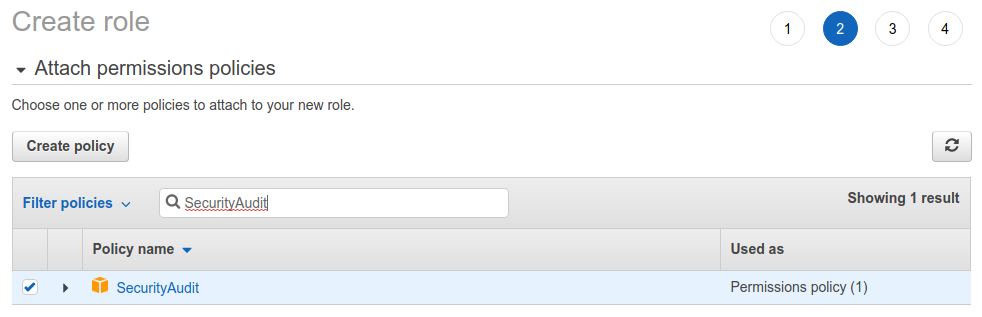

# Fraktal AWS Audit

This app allows you to audit and monitor your Amazon Web Services (AWS) assets for configuration weaknesses and security vulnerabilities automatically and continuously. It has been created in collaboration with our partner Fraktal Ltd, the experts in AWS security.

The app connects to your AWS account(s) with your consent. It then employs AWS Config, AWS Security Hub and Amazon GuardDuty to scan your AWS assets periodically, and provides you with alerts about any critical identified weaknesses and vulnerabilities in your configurations. 

The instructions below explain the installation of the app, integration with your AWS environment, how to enable AWS Config, AWS Security Hub and AWS GuardDuty functionalities, and how to grant the minimum permissions for Badrap to list your AWS assets and to scan them. 

When the app identifies vulnerabilities, it will provide you with comprehensive details of the finding and a link to the AWS console to find out more. If you would like to receive expert assistance to mitigate or fix the findings, you can contact Fraktal Ltd for their professional services.

## Install the Fraktal AWS Audit app

1. Open the [Fraktal AWS Audit](https://badrap.io/apps/fraktal) app page.
2. Install the app.

   

3. The app asks for permission to connect to your AWS account and to create assets to Badrap based on your AWS environment.

   

4. Enter your [AWS Account ID](https://console.aws.amazon.com/billing/home?#/account) into the `Account ID` field.
5. Create a recognizable role name for the app, e.g. "AWSAuditRole".

   

6. Note down the "External-ID" value that the app creates. You will need it later when creating a role delegation in the AWS console. 

## Create AWS role & policy

Configure role delegation for the app with the AWS IAM console.

1. Create a new role in the [AWS IAM console](https://console.aws.amazon.com/iam/home#/roles).

   

2. Select `Another AWS account` for the role type.
3. Enter `816084135002` (AWS Audit app Account ID) as the `Account ID`.
4. Check the `Require external ID` option, and enter the External ID that the app generated for you earlier.
5. Leave the `Require MFA` option unchecked.

   

6. Click `Next: Permissions`.
7. Type `ReadOnlyAccess` to the policy search bar, scroll down to find the correct policy and select it. 

   

8. Type `SecurityAudit` to the policy search bar, scroll down to find the correct policy and select it. 

   

9. Click `Next: Tags`.
10. Click `Next: Review`.
11. Name the role (e.g., `AWSAuditRole`).
12. Click `Create role`.

## Enable AWS Config

The app integrates with Amazon's tools AWS Config, Security Hub and GuardDuty to monitor for weaknesses and vulnerabilities in your configurations. You need to enable these features in your AWS console for the app to function properly. First, let's go through how to enable AWS Config.

1. Go to the [AWS Config](https://console.aws.amazon.com/config/home) setup page in AWS Console.

   

2. Select your AWS region (e.g. eu-north-1) from the drop-down menu in the right upper corner. 

   

3. Review the pricing for AWS Config, and then click on either "1-Click setup" or "Get started" to enable and configure AWS Config for your selected region.
4. Review the configuration and click "Confirm" to enable AWS Config.

   

AWS Config is required before you can enable AWS Security Hub or Amazon GuardDuty (next steps). 

## Enable AWS Security Hub

AWS Security Hub performs checks for security best practices. It automatically detects services that are configured in a way that leaves them vulnerable to attacks. It categorizes its findings into those that need immediate attention and those that can be dealt with later. Let's go through how to enable AWS Security Hub for your AWS services. 

1. Go to the [AWS Security Hub](https://console.aws.amazon.com/securityhub/home) setup page in AWS Console.

   

2. Select your AWS region (e.g. eu-north-1) from the drop-down menu in the right upper corner. 

   

3. Review the pricing, and then click on "Go to Security Hub" to enable and configure AWS Security Hub for your selected region. Make sure to turn on "Enable AWS Foundational Security Best Practices" and "Enable CIS AWS Foundations Benchmark".

   

Note that it may take up to a few hours before all of the compliance checks of AWS Security Hub are enabled.

## Enable Amazon GuardDuty

Amazon GuardDuty continuously monitors your AWS account for malicious activity and unauthorised behaviour. Whereas AWS Security Hub is more concerned about compliance and configurations, GuardDuty is more concerned about the runtime behaviour of your systems. You should use both of them to get the best possible results on both configuration and runtime security of your environment. Let's see how to enable Amazon GuardDuty.

1. Go to the [Amazon GuardDuty](https://console.aws.amazon.com/guardduty/home) setup page in AWS Console.

   

2. Select your AWS region (e.g. eu-north-1) from the drop-down menu in the right upper corner. 

   

3. Click on "Get started" to configure Amazon GuardDuty for your selected region. Review the pricing and click "Enable GuardDuty".

   

## AWS Regions and Accounts

All of the AWS and Amazon services for security monitoring and posture management are specific to a single AWS account and region.

If you have AWS services running in multiple regions or in multiple AWS accounts, and you want to audit all of them using the Fraktal AWS Audit app, you should repeat the steps above and enable AWS Config, AWS Security Hub and Amazon GuardDuty separately for each region and account that you are interested in.

Decide what accounts and regions you are interested in and start with those. You can start small and turn on checks on a test account or a single region to get acquainted with the AWS and Amazon security services before enabling them on all accounts and regions.

However, remember that it is a common security problem to assume that you have resources only on a specific AWS account or region. The resources that you don’t even know about, let alone have monitoring on, are often the ones that enable attackers to gain access to your environment.

## Uninstalling the app

If you want to stop using the app, you can uninstall the app and clean up the role delegation from your AWS IAM console. 

1. Go to the [Fraktal AWS Audit app page](https://badrap.io/apps/fraktal) and click **Uninstall**. 

   

2. Clean up the app role and policy definitions from your [AWS IAM console](https://console.aws.amazon.com/iam/home#/roles). 
3. Under the [Roles](https://console.aws.amazon.com/iam/home#/roles) section, search for the role you created earlier (e.g. "AWSAuditRole") and select **Delete**. 

   

4. Under the [Policies](https://console.aws.amazon.com/iam/home#/policies) section, search for the policy you created and connected to the role (e.g. "AWSAuditPolicy"), and from the **Policy actions** drop-down menu select **Delete**. 

   

5. That's it, you have successfully uninstalled the Fraktal AWS Audit app and cleaned up its configuration from your AWS installation.
