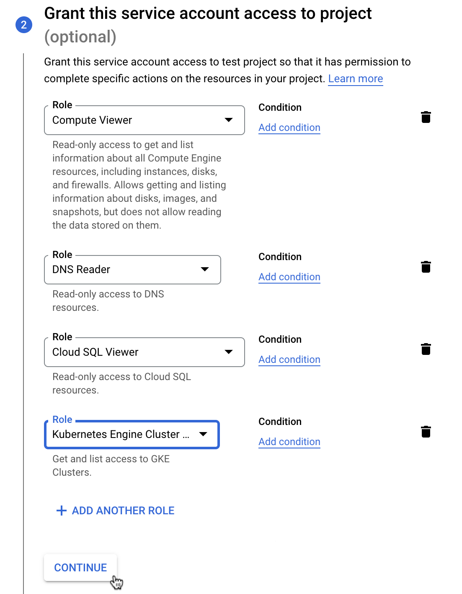

# Google Cloud Platform App

This app allows you to synchronize your Google Cloud Platform (GCP) assets into Badrap and receive security notifications about them. If you are not the owner or your organization's GCP project or projects, you will need help from the owner.

First, the owner of your organization's GCP project(s) creates a service account, downloads a key for it, and delivers the key to the Badrap GCP app user. Badrap GCP app user loads the key to the Badrap GCP app. Once installed, the app maintains a list of your organization's assets and add those assets under your Badrap user account. Namely:

- public IP-addresses from your GCP installation
- domain names, if GCP also hosts your DNS

## I am the owner of the GCP project

Create a service account with limited access:

1. Go to <https://console.cloud.google.com/iam-admin/serviceaccounts> (log in if necessary).
2. Select the project which public assets are going to be shared
3. Click on the **Create service account** button.

   

4. On the _Service account details_ area, give the account any name you want (for example "Service account for badrap.io").
   - Optionally add a description so you can remember what this service account is for.
   - Click the **Create** button.

   

5. On the _Service account permissions_ area, select the role _Compute Viewer_.
   - Click **Add another role** and add the _DNS Reader_ role.
   - Click the **Continue** button.

   

6. On the _Grant users access to this service account_ area, leave the fields empty and click the **Done** button. You will be taken back to the project's _Service accounts_ page.

7. On the _Service accounts_ page, find the row for the account you created, and click the three dots on the right.
   - Click **Manage keys**.
   - From the **Add key** drop-down menu, select **Create new key**.
   - When the key creation dialog opens, select **JSON** as the key type and click **Create**.
   - The key file is downloaded to your computer.
   - Close the dialog by clicking the **Close** button.

   

If you completed this process on behalf of someone else, deliver them the JSON key file containing the key to the service account. Delete the JSON key file from your local storage, once you don't need it anymore.

## I am the Badrap user

Install the Google Cloud Platform app.

1. Open the [Google Cloud Platform app page](https://badrap.io/apps/gcp) in Badrap and click the **Install** button.

2. The app will need your consent to _create and manage assets_ under your Badrap user account. Click Install the app to give your consent.

   

3. Click the **Add a new account** button. Upload the JSON key file you received or downloaded. Remember to delete the local file once the installation is finished and working.

   

4. Congratulations! You are all done. Check the [My assets page](https://badrap.io/assets) and find the section _Google Cloud Platform_ from your asset list. You should see your public IP-addresses. If your DNS records are also under your GCP project, you should see your domain names in the list too.

   

