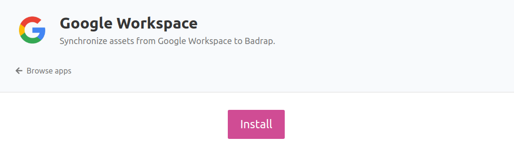
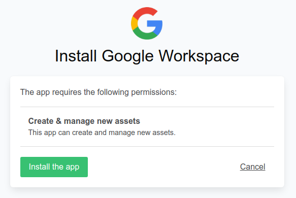
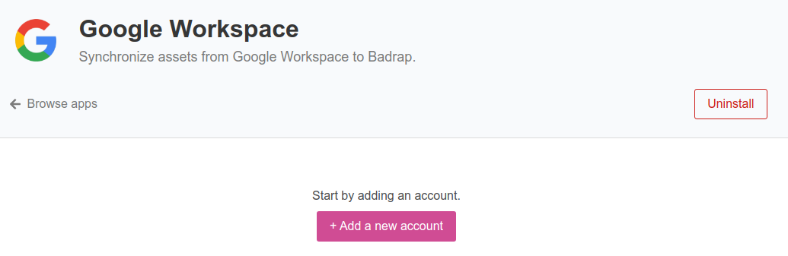
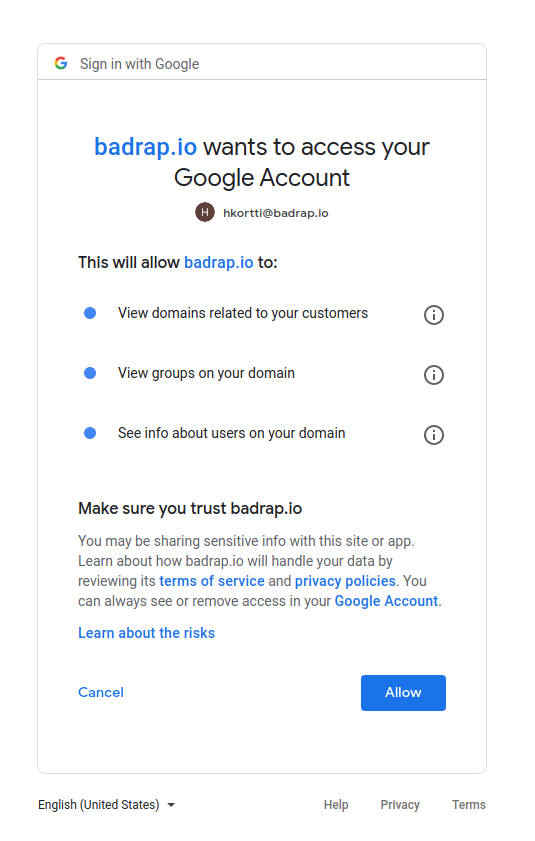
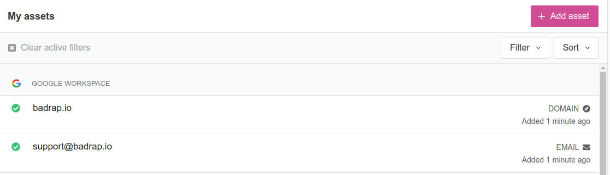

# Google Workspace App

This app allows you to synchronize your Google Workspace assets into Badrap and receive security notifications about them. 

Once installed, the app fetches a list of your organization's assets from your Workspace environment, and adds them as your assets in Badrap. Whenever your assets change in Workspace, they are synchronized and updated automatically in Badrap. Assets can include:

- Domain names
- Email addresses
- Groups

Note that the Google account that you use to connect the app to your Workspace installation will need to have **Super admin** role rights to fetch information on your assets.

## Installing the app

1. Open the [Workspace app page](https://badrap.io/apps/gworkspace). Click **Install**. 

   

2. Review the permissions that the app requests. Click **Install the app**.

   

3. Click on **Add a new account**. 

   

4. Select your Google account that you want to use to connect to your Google Workspace installation. 
5. Google will ask for your permission to share your Workspace assets with Badrap. Review the permissions and click **Allow** to provide your consent.

   

 
7. In a few minutes, you should see your assets under the **Google Workspace** section on your [My Assets](https://badrap.io/assets) page.

   

## Uninstalling the app

1. Open the [Workspace app page](https://badrap.io/apps/gworkspace) and click **Uninstall**. 
2. That's it - all assets listed by the app will disappear from your "My assets" page, and there is no need to clean up anything in your Google Workspace environment.
