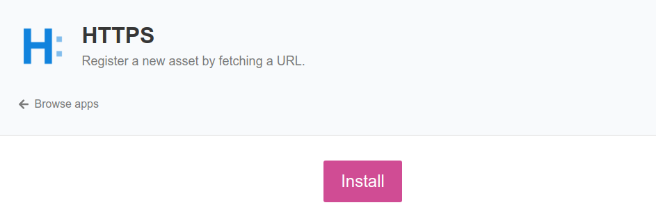
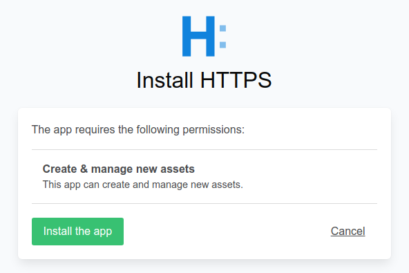
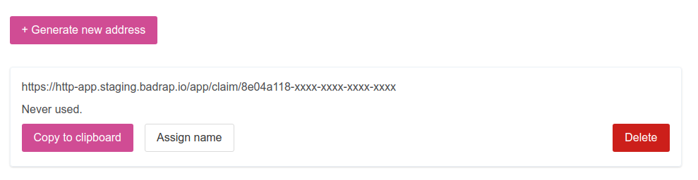
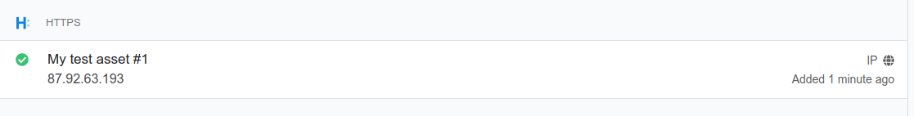

# HTTPS App

This app allows you to register a new asset into Badrap simply by fetching a URL. The IP address from which the request originates will be added as a new asset under your user account. You will receive security notifications about the asset you have registered, and you can use other Badrap apps to enrich or to interact with the asset. 

## Install the app

1. Open the [HTTPS app page](https://badrap.io/apps/https). 

<div style="text-align: center;">
   
</div>

2. Click **Install**. The app will ask for your permission to create new assets under your Badrap account. 

<div style="text-align: center;">
   
</div>

3. Click on **Install the app**. The app is now installed. 

## Add a new asset

1. Go to the [HTTPS app page](https://badrap.io/apps/https). Click on **Generate new address**. 

<div style="text-align: center;">
   
</div>

2. Click on the **Copy to clipboard** button to copy the URL onto your clipboard. You can also assign a name for the asset with the **Assign name** button.

<div style="text-align: center;">
   
</div>

3. On the host that you want to add as a new asset into Badrap, fetch the URL using a suitable application. For command-line usage, common tools for fetching an URL are e.g. [Wget](https://www.gnu.org/software/wget/) or [curl](https://curl.se/). These command-line tools are commonly available for Linux distributions. curl is built into Mac OS X, and into Windows 10 command line and PowerShell environments. For desktop hosts, you can simply fetch the URL with any web browser.

   Example using wget:
   ```
   wget https://http-app.badrap.io/app/claim/1abc...
   ```
   Example using curl:
   ```
   curl https://http-app.badrap.io/app/claim/1abc...
   ```

4. The IP address of the host from which you fetched the URL will be registered and displayed as a new asset in your [My assets](https://badrap.io/assets) page. If you assigned a name for your asset, it will also be displayed. The list shows also when the asset has been registered. 

<div style="text-align: center;">
   
</div>

## Update an asset

1. If the IP address of your asset changes, you can update the asset simply by fetching the same URL again from the asset host. The asset is updated to reflect the current IP address. This way, you can keep assets with dynamically changing IP addresses easily up-to-date: just create a scheduled task on your asset host to periodically fetch the URL associated with it. If you want to update the name of the asset, you can do so with the **Assign name** button. 

2. You can also always just delete the previously generated URL associated with the asset and create a new one.

## Delete an asset

1. Go to the [HTTPS app page](https://badrap.io/apps/https). Find the URL that you used to register the asset that you want to delete. Click on **Delete**. 

2. The asset registered with the URL will be deleted from your [My assets](https://badrap.io/assets) page.

## Uninstall the app

1. Go to the [HTTPS app page](https://badrap.io/apps/https) and click **Uninstall**.

2. The app is now uninstalled. Any assets you registered with the app are also deleted from your [My assets](https://badrap.io/assets) page.
