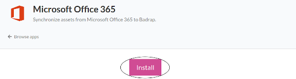
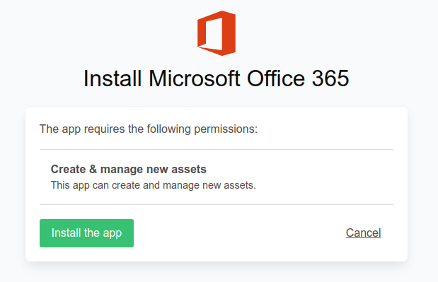
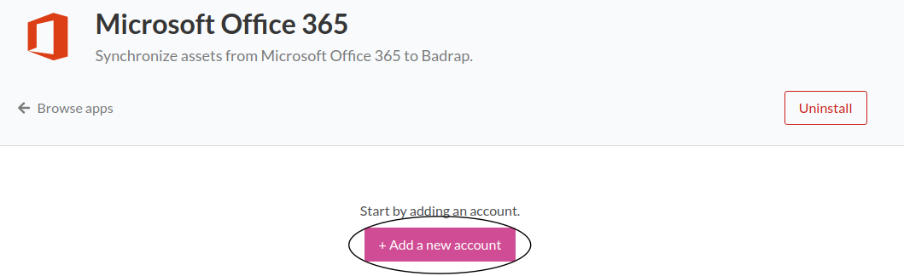
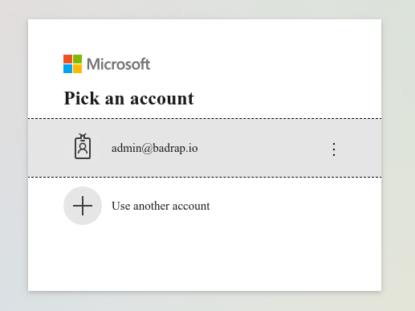
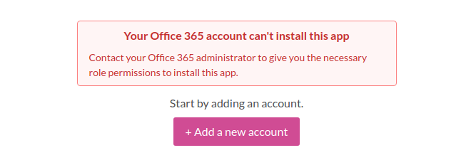
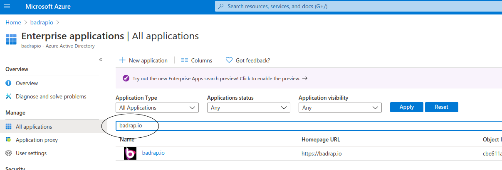
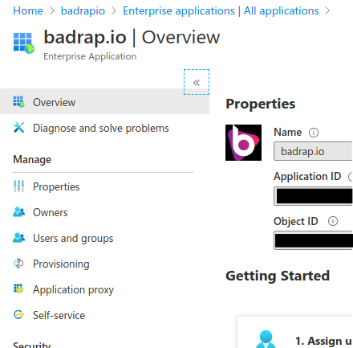
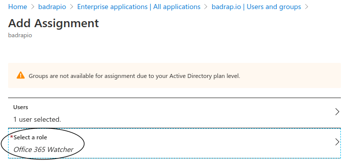

# Microsoft Office 365

This app allows you to synchronize your Office 365 assets into Badrap and receive security notifications about them. The app needs to be installed and enabled under your Badrap user account to get started. The app fetches a list of your organization's assets from your Office 365 installation with your consent, and adds those assets under your Badrap user account. If you do not have administrator rights for your organization's Office 365 installation, you will need help from your administrator to set up the app.

## I am an Office 365 administrator

The easiest way to set up Badrap's Office 365 app is if you have administrator rights for your Office 365 environment. You can install the app and import all of your Office 365 assets to be visible under your Badrap user account. You can also optionally give permission to other Badrap users inside your organization to see the same information that you do.

You need to have one of the following administrator roles for your Office 365 environment to install the app:

 * Global administrator
 * Application administrator
 * Cloud application administrator

If you do not have any of these administrator rights, please refer to the [I am an Office 365 user](./#i-am-an-office365-user) section below. 

1. To start the app installation, open the [Office 365 app page](https://badrap.io/apps/office365/). Click on "Install".

2. Review the permissions that the Office 365 app requires. If the permissions are acceptable for you, click on "Install the app". 

3. Click on "Add a new account". 

4. Your Office 365 login window will appear. Log in with your administrator account. 

5. The app will fetch a list of your organization's Office 365 assets. You can then see those assets under the "Microsoft Office 365" section in your [My Assets](https://badrap.io/assets) listing.

## I am an Office 365 user

You can also install and use Badrap's Office 365 app as a regular Office 365 user. In this scenario, you will need help from your organization's Office 365 administrator to allow importing your organization's Office 365 assets into Badrap.

1. To start the app installation, open the [Office 365 app page](https://badrap.io/apps/office365/). Click on "Install".

2. Review the permissions that the Office 365 app requires. If the permissions are acceptable for you, click on "Install the app".

3. Click on "Add a new account".

4. Your Microsoft Office 365 login window will appear. After you log in, you will see a notification that you need to contact your Office 365 administrator to give your user account permissions to install the app.

. 

5. Your organization's Office 365 administrator will need to allow access for the Badrap application through the [Azure dashboard](https://portal.azure.com). You can forward the instructions below for your Office 365 administrator. 

6. After your Office 365 administrator has given you sufficient permissions, you can use the Badrap Office 365 app. The app will fetch a list of your organization's Office 365 assets. You can then see those assets under the "Microsoft Office 365" section in your [My Assets](https://badrap.io/assets) listing.

## Instructions for Office 365 administrators to allow a user to install Badrap Office 365 app

1. Log in to your [Azure dashboard](https://portal.azure.com) with your administrator credentials. 

2. You will first need to create a service principal for the Badrap app in your Azure AD dashboard. You can use the following quick link to [create the service principal](https://login.microsoftonline.com/organizations/v2.0/adminconsent?client_id=57e819f3-bb1d-44e8-91c7-fe7d702e622d&scope=openid%20offline_access%20https://graph.microsoft.com/user.read.all%20https://graph.microsoft.com/group.read.all&redirect_uri=https://ms-apps.badrap.io/o365/callback). Note that even though the response shown after clicking the link does not show a full response page, the service principal is still created correctly.

3. Select [Azure Active Directory](https://portal.azure.com/#blade/Microsoft_AAD_IAM/ActiveDirectoryMenuBlade/Overview) from your Azure dashboard menu.

4. Go to "Enterprise Applications" -> "Application Type" -> dropdown to "All Applications" -> write "badrap.io" into the application search text field. Click on the "badrap.io" search result.

5. On the page that opens up go to "Users and groups".

6. Click "Add user" and select the correct user account and role(s) you want to give to that user. For the Badrap Office 365 app, the required role is "Office 365 Watcher". Click "Assign" after you have selected the user and role. 

