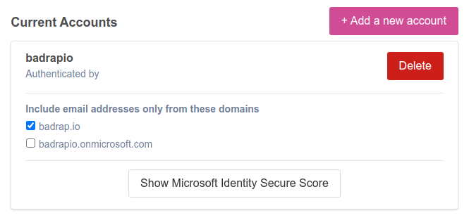

# Microsoft Office 365

This app allows you to synchronize your Office 365 assets into Badrap and receive security notifications about them. The app needs to be installed and enabled under your Badrap user account to get started. The app fetches a list of your organization's assets from your Office 365 installation with your consent, and adds those assets under your Badrap user account. It will also show how many users in your organization have Multi-Factor Authentication (MFA) enabled. If you do not have administrator rights for your organization's Office 365 installation, you will need help from your administrator to set up the app.

## I am an Office 365 administrator

The easiest way to set up Badrap's Office 365 app is if you have administrator rights for your Office 365 environment. You can install the app and import all of your Office 365 assets to be visible under your Badrap user account. You can also optionally give permission to other Badrap users inside your organization to see the same information that you do.

You need to have one of the following administrator roles for your Office 365 environment to install the app:

- Global administrator
- Application administrator
- Cloud application administrator

If you do not have any of these administrator rights, please refer to the [I am an Office 365 user](./o365.md#i-am-an-office-365-user) section below.

1. To start the app installation, open the [Office 365 app page](https://badrap.io/apps/office365/). Click on **Install**.

   

2. Review the permissions that the Office 365 app requires. If the permissions are acceptable for you, click on **Install the app**.

   

3. Click on **Add a new account**.

   

4. Your Office 365 login window will appear. Log in with your administrator account.

   

5. The Office 365 app can also tell you if your organization has **Multi-Factor Authentication** (MFA) in use. Using MFA is a recommended best practice that will keep your organization protected against phishing attacks and data breaches. The app will display your MFA usage results along with a Microsoft Identity Secure Score, which is a numerical score created by Microsoft that shows how securely your Office 365 installation is configured. You can enable the MFA check by clicking on the **Show Microsoft Identity Secure Score** button after you add your Office 365 account. 

   

6. Microsoft Identity Secure Score will show how many of your administrator role users and regular users have MFA enabled. Note that it may take a minute or two for the app to fetch the MFA and Secure Score information from your Office 365 server. If you can do something to improve your score, clear instructions will explain what steps you can take. The link under the advice will take you to your Office 365 administration portal, which will provide further details on how the score is calculated, how your MFA settings are configured, and how to improve things. 

   

7. After you have added your account, the app will display your organization's Office 365 assets under the "Microsoft Office 365" section in your [My Assets](https://badrap.io/assets) listing.

## I am an Office 365 user

You can also install and use Badrap's Office 365 app as a regular Office 365 user. In this scenario, you will need help from your organization's Office 365 administrator to allow importing your organization's Office 365 assets into Badrap.

1. To start the app installation, open the [Office 365 app page](https://badrap.io/apps/office365/). Click on **Install**.

   

2. Review the permissions that the Office 365 app requires. If the permissions are acceptable for you, click on **Install the app**.

   

3. Click on **Add a new account**.

   

4. Your Microsoft Office 365 login window will appear. After you log in, you will see a notification that you need to contact your Office 365 administrator to give your user account permissions to install the app.

   

5. Your organization's Office 365 administrator will need to allow access for the Badrap application. You can forward the instructions below for your Office 365 administrator.

6. After your Office 365 administrator has given you sufficient permissions, you can use the Badrap Office 365 app. The app will fetch a list of your organization's Office 365 assets. You can then see those assets under the **Microsoft Office 365** section in your [My Assets](https://badrap.io/assets) listing.

## Instructions for Office 365 administrators to allow a user to install Badrap Office 365 app

1. Click the following "Give admin consent" link to open the admin consent page for the Badrap for Office 365 application:

   [Give admin consent](https://login.microsoftonline.com/organizations/v2.0/adminconsent?client_id=f759d490-27d4-4c1b-839a-42b48ed82e2c&scope=.default&redirect_uri=https://ms-apps.badrap.io/o365/adminconsent)
