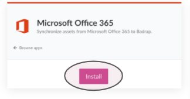
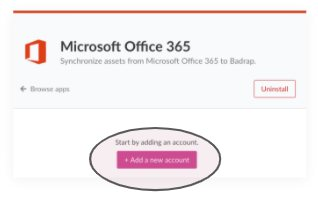
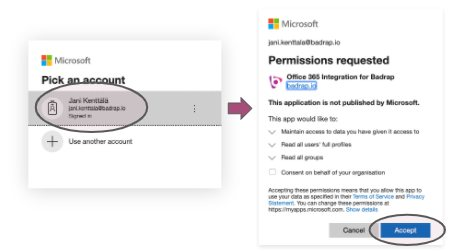

# Microsoft Office 365

Connect to Microsoft Office 365 to automatically bring your organisation's email addresses into Badrap for monitoring.

## Install the App

1. Open the [Office365 app page](https://badrap.io/apps/office365)

2. Click add new account

3. Log in, review the reuqested permissions and click accept

4. You're done. Now open [My Assets](https://badrap.io/assets) page and find your organisation's emails under "Microsoft Office 365" category.