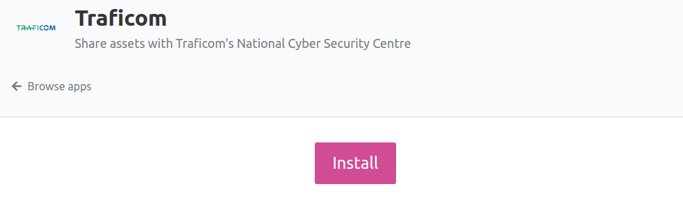
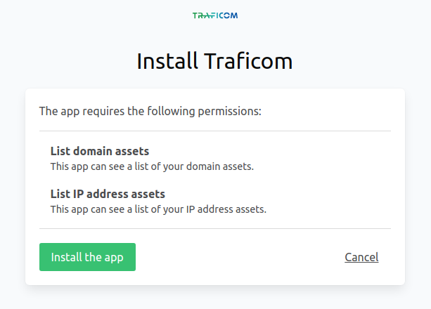
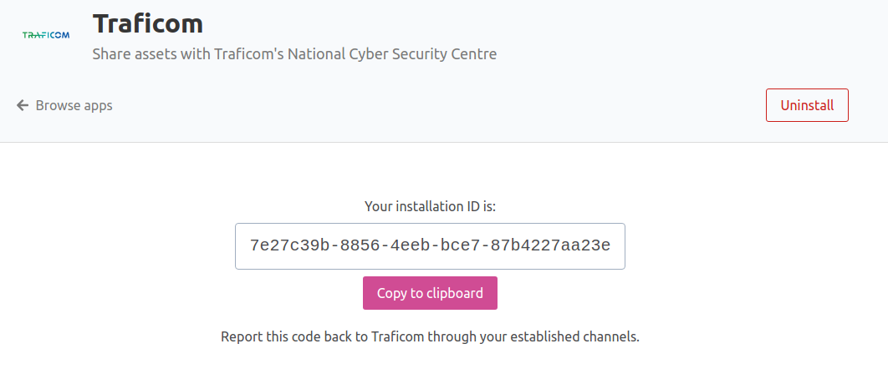

# Traficom

Traficom app allows you to share your asset information with NCSC-FI (Kyberturvallisuuskeskus), the National Cyber Security Centre of Finland.

Sharing your Badrap asset information with NCSC-FI allows you to receive more accurate incident and vulnerability information about your valuable
online resources.

By installing the app, you agree to share the list of your network assets (IP addresses and domain names) from Badrap to NCSC-FI. When you share the app
installation ID with NCSC-FI, they can tell your assets belong to your organization.

Note that NCSC-FI is responsible for communicating about cyber security incidents and vulnerabilities with companies, organizations and 
individuals within Finland. If you are a Badrap user outside of Finland, you are probably better served by contacting your own local cyber 
security coordination centre.

## Installation

1. Open the [Traficom app page](https://badrap.io/apps/traficom)
2. Click **Install**.

   

3. Review the permissions the app requests. Click **Install the app**.

   

4. Send the app installation ID by email to kyberturvallisuuskeskus@traficom.fi.

   

5. Note that the installation ID is not a secret, and only NCSC-FI can use it to list your assets through Badrap's app API.

## Uninstalling the app

1. Open the [Traficom app page](https://badrap.io/apps/traficom) and click **Uninstall**.  
2. That's it, you're done.
