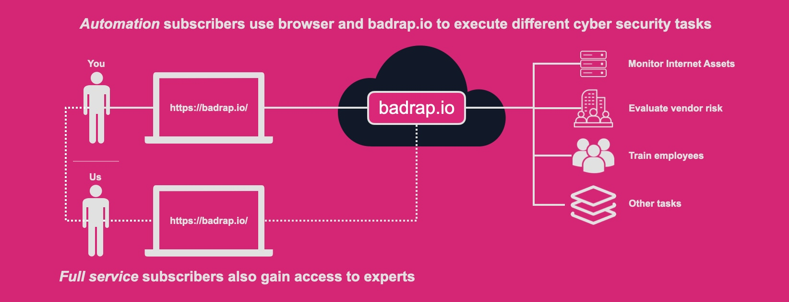

# Service Description

Some commercial contracts we make with our customers may require us to describe certain aspects of our service. In the spirit of transparency, we publish the description here.

## Content and implementation of the service

badrap.io is a hosted subscription service to accomplish key compliance needs cost-effectively and easily. Companies subscribe to badrap.io online service. Users of the service use online step-by-step playbooks and automation to complete cyber security tasks. Tasks range from cyber security training to automated monitoring of the subscriber's digital footprint.

Subscribers on the *Automation* tier can use a modern web-based interface to drive the service to help them to accomplish daily cyber security tasks. The service supports users by keeping track of the subscribers' assets and providing apps for automating manual work.

*Full service* tier subscribers gain access to experts in addition to automation. Experts help execute the playbooks together with the subscribers. Furthermore, execution of some of the playbooks to the fullest extent requires a *Full service* tier subscription. The execution pace is three months per each cyber security playbook. For example, a subscriber can execute employee cyber security training during the first three months of the subscription. During the next three months, the customer can assess the risks related to their supply chain. Customers can focus on executing one playbook repeatedly, or different playbooks over time.

## Responsibilities

Once a customer has subscribed to the service, the customer creates their own user accounts at badrap.io. Badrap experts will create a badrap.io team for the organization and grant access to the first users of the subscribing organization. After that, members in the customer team can grant access to other users in their organization themselves. Only users who manage and use the service need a user account to badrap.io.

After a customer has access to the service, the customer can use the automation (and depending on the subscription tier, expert assistance) to execute cyber security playbooks.

## The supplier's subcontractors who process personal data

We do not subcontract the processing of personal data.
We may have data recipients. An up-to-date list of data recipients is always available at <https://docs.badrap.io/privacy.html> .

## The procedures in place to secure (backup) the client's material in the service

We only store a minimal amount of configuration information to relay relevant messages to and from you. We design and operate the service so that encryption is used for data transfer and storage whenever possible, according to standard security practices. 

We backup our production database at least once per day. We store these backups for a minimum of seven days.

## Installation, modification and maintenance windows

As we are serving a global audience, we may perform installations, modifications and maintenance around the clock. Typical service interruptions are minimal, lasting only a few seconds or minutes.

## The location where the service is produced

All data in our service is stored in data centres within the EU.
Maintenance and management are conducted in Finland.
See our privacy policy for more details: <https://docs.badrap.io/privacy.html>.
